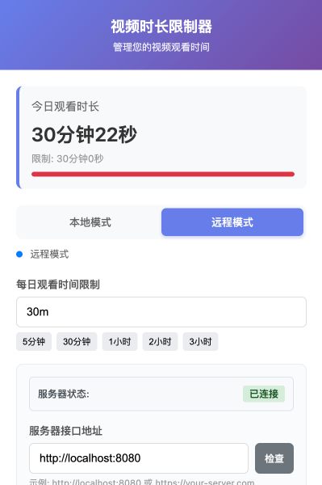

# 视频时长限制器 (Video Time Limiter)

一个基于Chromium内核的浏览器扩展，支持Chrome、Edge、Opera、Brave等浏览器，用于监控和限制用户的视频观看时间，帮助用户合理控制娱乐时间，提高工作效率。

## 🚀 功能特性

- **智能监控**: 自动检测网页中的视频播放，实时统计观看时长
- **时间限制**: 设置每日视频观看时间上限，超时自动提醒
- **双模式存储**: 支持本地存储和远程服务器同步
- **用户友好**: 简洁的设置界面，一键配置所有参数
- **跨平台同步**: 通过服务器API实现多设备数据同步
- **自定义提醒**: 可自定义超时提醒内容
- **广泛兼容**: 支持Chrome、Edge、Opera、Brave等所有Chromium内核浏览器
- **无缝迁移**: 在不同浏览器间轻松迁移和使用

## 📁 项目结构

```
video_time_limiter/
├── limiter/                 # 浏览器扩展源码
│   ├── manifest.json        # 扩展配置文件
│   ├── background.js         # 后台服务脚本
│   ├── content.js           # 内容脚本
│   ├── popup.html           # 设置界面
│   ├── popup.js             # 设置界面逻辑
│   ├── fileStorage.js       # 存储管理
│   └── *.png               # 扩展图标
├── server/                  # Go后端服务
│   ├── cmd/                 # 应用入口
│   ├── internal/            # 内部模块
│   ├── config/              # 配置文件
│   ├── go.mod              # Go模块定义
│   ├── Dockerfile          # Docker构建文件
│   └── docker-compose.yaml # Docker编排文件
└── README.md               # 项目说明文档
```

## 🛠️ 技术栈

### 前端 (浏览器扩展)
- **Manifest V3**: 最新的Chromium扩展API
- **JavaScript**: 原生JS实现，无框架依赖
- **Browser APIs**: storage, activeTab, scripting等
- **兼容性**: 支持所有基于Chromium内核的浏览器

### 后端 (Go服务)
- **Go 1.24**: 高性能后端语言
- **Gin**: 轻量级Web框架
- **Gone框架**: 依赖注入和模块化架构
- **Viper**: 配置管理
- **Docker**: 容器化部署

## 📦 安装部署

### 浏览器扩展安装

本扩展支持所有基于Chromium内核的浏览器，包括但不限于：
- **Google Chrome**
- **Microsoft Edge** 
- **Opera**
- **Brave Browser**
- **Vivaldi**
- **360安全浏览器**
- **QQ浏览器**

#### 1. 开发者模式安装

```bash
# 克隆项目
git clone <repository-url>
cd video_time_limiter
```

**Chrome/Edge/Opera等浏览器**:
1. 打开扩展管理页面：
   - Chrome: `chrome://extensions/`
   - Edge: `edge://extensions/`
   - Opera: `opera://extensions/`
2. 开启"开发者模式"
3. 点击"加载已解压的扩展程序"
4. 选择 `limiter/` 文件夹

#### 2. 打包安装

```bash
# 使用已打包的crx文件
# 将 limiter.crx 拖拽到对应浏览器的扩展页面
```

**注意**: 某些浏览器可能需要手动启用"允许来自其他商店的扩展"选项。

### 后端服务部署

#### 方式一: Docker部署 (推荐)

```bash
# 进入服务器目录
cd server/

# 使用Docker Compose启动
docker-compose up -d

# 服务将在 http://localhost:8080 启动
```

#### 方式二: 源码编译

```bash
# 确保已安装Go 1.24+
cd server/

# 安装依赖
go mod download

# 编译运行
go run cmd/server/main.go
```

## 🎯 使用说明

### 1. 基础配置

1. 点击浏览器工具栏中的扩展图标
2. 在弹出的设置界面中配置:
   - **时间限制**: 设置每日视频观看时间上限(毫秒)
   - **用户ID**: 唯一标识符，用于数据同步
   - **服务器地址**: 远程API地址(可选)
   - **提醒内容**: 自定义超时提醒文字



*扩展设置界面展示了当前观看时长、时间限制设置、工作模式选择等功能*

### 2. 工作模式

- **本地模式**: 不设置服务器地址，数据存储在浏览器本地
- **远程模式**: 设置服务器地址，数据同步到远程服务器

### 3. 监控机制

- 扩展会自动检测页面中的视频元素
- 实时统计视频播放时长
- 当累计时长超过设定限制时弹出提醒
- 关闭提醒后如继续播放，2秒后再次提醒


*当观看时间超过限制时，会弹出醒目的提醒窗口，显示当前观看时长和限制时间*

## 🔧 API接口

### 获取用户数据
```http
GET /api/v1/videos/{userId}
```

### 提交观看记录
```http
POST /api/v1/videos/{userId}
Content-Type: application/json

{
  "url": "https://example.com/video",
  "watchTime": 1800,
  "at": "2025-01-15T10:30:00Z"
}
```

### 设置时间限制
```http
PUT /api/v1/videos/{userId}
Content-Type: application/json

{
  "limitTime": 120000
}
```

详细API文档请参考: [server/API接口文档.md](server/API接口文档.md)

## 🏗️ 开发指南

### 扩展开发

```bash
# 进入扩展目录
cd limiter/

# 修改代码后重新加载扩展
# 在浏览器扩展页面点击刷新按钮
```

**浏览器兼容性测试**:
- 建议在多个Chromium内核浏览器中测试扩展功能
- 重点测试Chrome、Edge、Opera的兼容性
- 确保API调用在不同浏览器中的一致性

### 服务端开发

```bash
# 进入服务器目录
cd server/

# 安装开发工具
go install github.com/gone-io/gonectl@latest
go install go.uber.org/mock/mockgen@latest

# 生成代码
go generate ./...

# 运行测试
go test ./...

# 启动开发服务器
go run cmd/server/main.go
```

## 📊 系统架构

项目采用前后端分离架构:

- **Content Script**: 注入到网页，监控视频播放
- **Background Script**: 后台服务，处理数据存储和业务逻辑  
- **Popup Interface**: 用户设置界面
- **Go Backend**: RESTful API服务，提供数据持久化

### 浏览器兼容性架构

扩展基于标准的Chromium Extension API构建，确保在所有Chromium内核浏览器中的兼容性：

- **Manifest V3**: 使用最新的扩展标准，向前兼容
- **标准Web APIs**: 避免使用浏览器特定的API
- **跨浏览器存储**: 使用chrome.storage API，在所有Chromium浏览器中通用
- **统一权限模型**: 权限配置适用于所有支持的浏览器

详细的消息流程图请参考: [消息流图.md](消息流图.md)

## 🤝 贡献指南

1. Fork 本项目
2. 创建特性分支 (`git checkout -b feature/AmazingFeature`)
3. 提交更改 (`git commit -m 'Add some AmazingFeature'`)
4. 推送到分支 (`git push origin feature/AmazingFeature`)
5. 开启 Pull Request

## 📄 许可证

本项目采用 MIT 许可证 - 查看 [LICENSE](LICENSE) 文件了解详情

## 🐛 问题反馈

如果您发现任何问题或有改进建议，请在 [Issues](../../issues) 页面提交。

## 📞 联系方式

- 项目维护者: [degfy](https://github.com/degfy)
- 邮箱: [degfy@outlook.com](mailto:degfy@outlook.com)

---

⭐ 如果这个项目对您有帮助，请给我们一个星标！